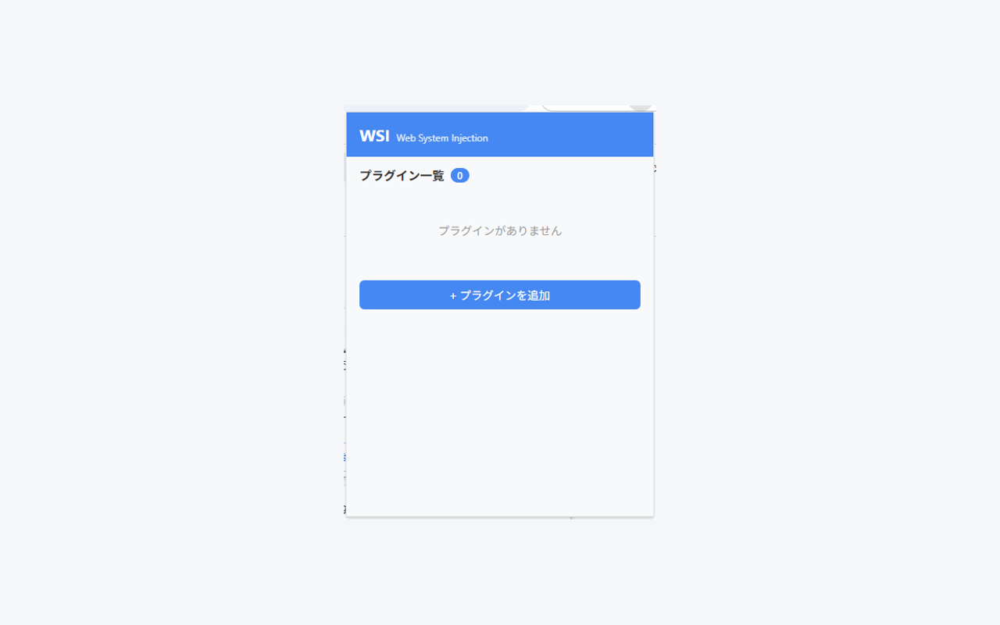

# Web System Injection (WSI)

**既存のWebサイトにカスタム機能（プラグイン）を注入できるChrome拡張機能**

*A plugin-based Chrome extension for injecting custom features into any website.*

WSI は、ユーザがZIP形式でプラグインをインポートし、指定したドメインでだけ実行する、開発者向けのプラグインプラットフォームです。ドメイン単位でカスタマイズを管理でき、プラグインは簡潔な SDK（`WSI.addButton` / `WSI.addPanel` / `WSI.storage` / `WSI.fetch` など）を通じてページへ機能を追加します。



## 主な特徴

- 📦 **ZIPをインポートするだけ** — プラグインの構造は `plugin.json` + `main.js`（+ CSS）の3ファイル
- 🎯 **ドメイン単位の実行制御** — 各プラグインが対象ドメインを宣言し、そこでだけ動作
- 🧰 **シンプルな SDK** — `addButton` / `addPanel` / `storage` / `fetch` / `onPageLoad` など、数十行で実用プラグインが書ける
- 🌐 **CORS を超えた `WSI.fetch`** — 他サイトのAPIにもアクセスできる（Service Worker 経由）
- 🔒 **データは全てローカル** — `chrome.storage.local` のみ使用、外部送信なし
- 🌏 **i18n 対応** — 日本語 / English / 한국어 / 中文 の4言語UI
- ⚡ **グローバルON/OFFトグル** — 一時停止も1クリック

## インストール

### Chrome Web Store（推奨・審査中）

現在 Chrome Web Store へ申請中です。承認され次第、ここにリンクを掲載します。

### 手動インストール（開発版）

1. リポジトリをクローン
   ```bash
   git clone https://github.com/Serendipity1118/WebSystemInjection.git
   ```
2. Chrome で `chrome://extensions` を開き、右上の**デベロッパーモード**をON
3. 「**パッケージ化されていない拡張機能を読み込む**」をクリックし、`src/` ディレクトリを選択

## 同梱サンプルプラグイン

インストール直後は空の状態です。以下のサンプルを順に試すことで、WSI でできることの感覚がつかめます。各サンプルは手順説明付きのREADMEと、そのままインポート可能なZIPを同梱しています。

| サンプル | 対象 | 概要 | 主なSDK |
|---|---|---|---|
| [hello-world](samples/example.com/hello-world/) | example.com | 👋 ボタンを表示する入門サンプル | `addButton` / `getConfig` / `log` |
| [url-expander](samples/universal/url-expander/) | 全サイト | 短縮URLにホバーすると最終URLをツールチップ表示 | `fetch`（HEAD + リダイレクト追跡） |
| [markdown-copy](samples/universal/markdown-copy/) | 全サイト | 選択テキストをMarkdown形式でクリップボードにコピー | `addButton` + Selection API + Clipboard API |
| [highlighter](samples/universal/highlighter/) | 全サイト | ページをハイライト、URL別に永続化、再訪時に自動復元 | `storage` 4API + `onPageLoad` |
| [outline-panel](samples/universal/outline-panel/) | 全サイト | h1〜h6 見出しからTOCサイドパネルを生成 | `addPanel` + `onPageLoad` |

## 自分のプラグインを作る

📘 **[ビジュアル版 プラグイン開発ガイド](html/index.html)** も用意しています（ローカルで開く場合は `html/index.html` をブラウザで直接開いてください）。以下は要約版です。

### 1. プラグインの構造

```
my-plugin/
├── plugin.json    # 必須: プラグイン定義
├── main.js        # 必須: プラグイン本体
└── style.css      # 任意: スタイルシート
```

### 2. `plugin.json` の最小例

```json
{
  "id": "my-plugin",
  "name": "My Plugin",
  "version": "1.0.0",
  "description": "説明文",
  "domains": ["example.com", "*.example.com"],
  "scripts": { "main": "main.js" }
}
```

`domains` には対象サイトを配列で指定:

- `"example.com"` — 完全一致
- `"*.example.com"` — サブドメイン全て
- `"*"` — 全サイト（WSI v1.2.0〜）

### 3. `main.js` の例

```javascript
WSI.addButton({
  text: '▶',
  position: 'bottom-right',
  onClick: () => alert('Hello!'),
});

WSI.log('プラグインが読み込まれました');
```

### 4. ZIP化してインポート

3ファイルをZIPにまとめ、WSIポップアップの「プラグインを追加」からドロップ。詳しい仕様は [doc/要件定義.md](doc/要件定義.md) を参照。

## SDK サマリー

| API | 用途 |
|---|---|
| `WSI.addButton(options)` | フローティングボタンを追加（ドラッグで移動可能、位置はプラグイン別に永続化） |
| `WSI.addPanel(options)` | サイドパネルを追加 |
| `WSI.storage.get/set/remove/getAll` | プラグイン固有の永続ストレージ |
| `WSI.fetch(url, options)` | CORS制限なしの fetch（Service Worker 経由） |
| `WSI.onPageLoad(callback)` | SPA の URL 変更を検知 |
| `WSI.getConfig()` | `plugin.json` の `config` 値を取得 |
| `WSI.log(message)` | `[WSI:<plugin-id>]` プレフィックス付きログ |

詳細: [doc/要件定義.md](doc/要件定義.md#sdk-api仕様)

## プライバシー

WSI 自体は以下のデータのみ扱います:

- ユーザがインポートしたプラグインのコード・設定
- 各プラグインの永続ストレージ（`WSI.storage` API 経由で保存されたもの）

**すべて `chrome.storage.local`（あなたのブラウザ内）にのみ保存され、外部サーバーへの送信は一切行いません。**

個々のプラグインが外部通信する場合は、そのプラグインのソースコードでご確認ください。

## 開発

```bash
npm install
npm run playwright:install       # 初回のみ
npm run test:e2e                 # e2e テスト実行
npm run test:e2e:headed          # ブラウザを表示しながら
```

開発者向けの追加情報:

- [CLAUDE.md](CLAUDE.md) — アーキテクチャ・規約・ハマりどころ
- [doc/要件定義.md](doc/要件定義.md) — 機能要件・SDK仕様
- [tests/e2e/](tests/e2e/) — Playwright e2e テスト

## ライセンス

ISC

## 関連プロジェクト

- [Tampermonkey](https://www.tampermonkey.net/) — 同ジャンルのUserScript管理ツール
- [Violentmonkey](https://violentmonkey.github.io/) — 同上（オープンソース）
